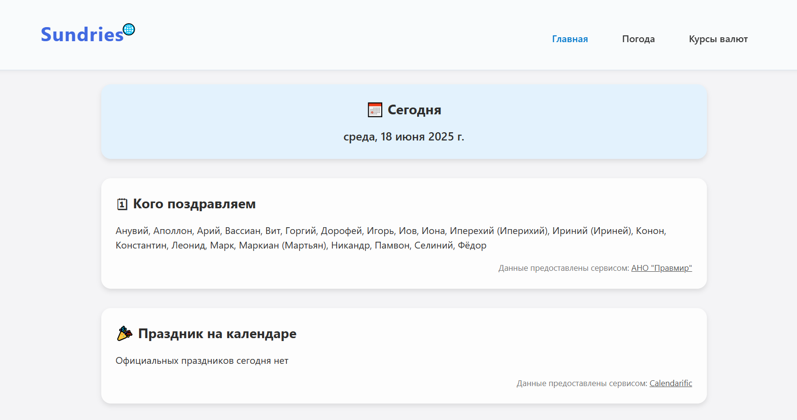
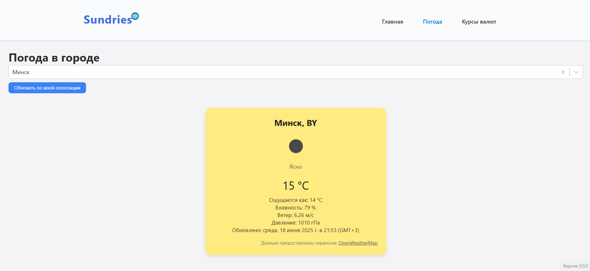
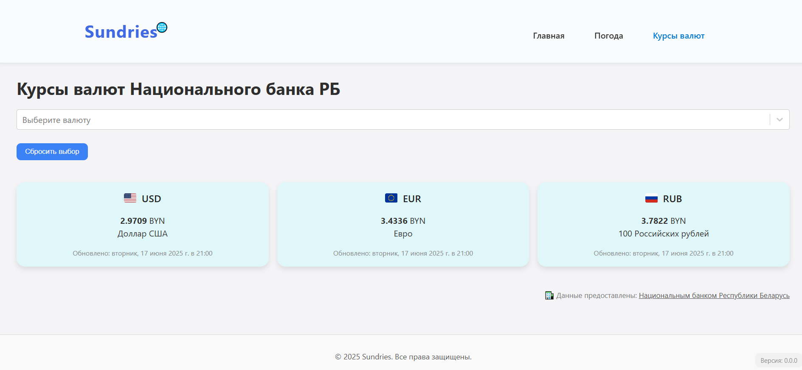

# Sundries / Всякая всячина

[](./LICENSE)

Sundries is a clean and lightweight web dashboard that gathers useful everyday info: current weather, exchange rates, Orthodox name days, and calendar highlights — all in one minimal interface.

Sundries — это лёгкое и лаконичное веб-приложение-дашборд, которое собирает повседневные мелочи: погоду, курсы валют, именины, праздники и заметные даты — всё в одном минималистичном интерфейсе.

---

## Features / Особенности

- 🧭 Interactive daily dashboard powered by real APIs
- 🌤 Live weather data (by location)
- 💱 Daily exchange rates from a currency API
- 📅 Orthodox name days and holidays (dynamically loaded)
- 💬 Daily quote, joke, and advice (from external APIs)
- 🧠 Interesting word and trivia of the day
- 🔮 Daily horoscope (12 zodiac signs)
- 🌌 NASA “Image of the Day” with description
- 📜 Auto-translation for English content
- 💬 Russian interface elements
- 📱 Fully responsive and mobile-friendly
- 🔄 All modules update dynamically from external sources

/

- 🧭 Интерактивный дашборд на каждый день с данными по API
- 🌤 Погода в реальном времени (с учётом местоположения)
- 💱 Ежедневные курсы валют с внешнего сервиса
- 📅 Именины и праздники, загружаемые динамически
- 💬 Цитата, шутка и полезный совет дня (через API)
- 🧠 Интересное слово и викторина на сообразительность
- 🔮 Персональный гороскоп (все знаки зодиака)
- 🌌 Изображение дня от NASA с описанием
- 📜 Автоматический перевод англоязычных блоков
- 💬 Элементы интерфейса на русском
- 📱 Адаптивность под любые экраны
- 🔄 Все данные обновляются с помощью внешних API

---

## 🚀 Why This Project?

Sundries is more than a simple utility — it shows how I approach clean architecture, modern React features (lazy, routing v7), and thoughtful UX.
This app is intentionally lightweight yet practical — just like real-world tools should be.

---

## 📸 Screenshots / Скриншоты

### 🏠 Главная


### ☀️ Погода


### 💱 Курсы валют


---

## Built With / Используемые технологии

- React + Vite
- React Router v7 (with `createBrowserRouter`)
- React.lazy + Suspense (code splitting)
- CSS Modules
- GitHub Pages (deployment)

---

## Getting Started / Начало работы

```bash
git clone https://github.com/AlexandrMaspanov/sundries.git
cd sundries
npm install
npm run dev
```
---

Local app will be available at: http://localhost:5173/sundries/

Приложение будет доступно по адресу: http://localhost:5173/sundries/

---

## License / Лицензия

[MIT](LICENSE)

---

## Author / Автор

Developed by [Александр Маспанов](https://github.com/AlexandrMaspanov)

Разработано с вниманием к деталям и в духе минимализма ✨
